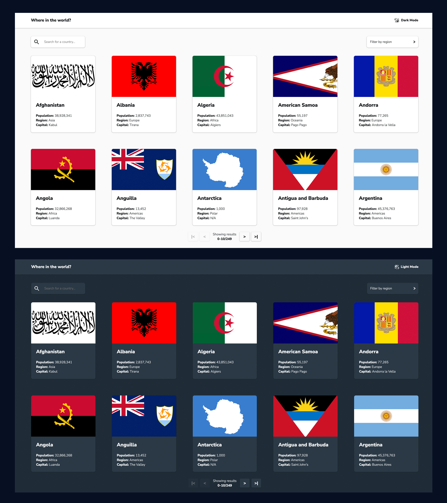
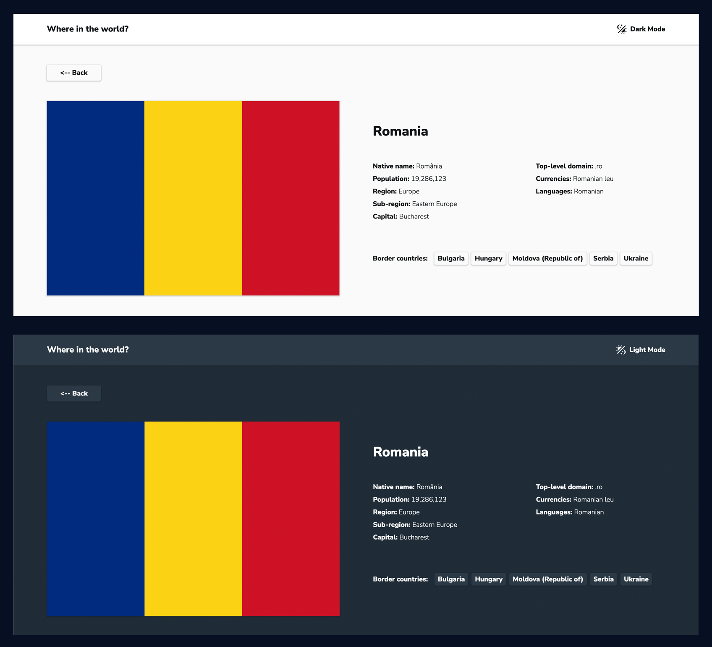
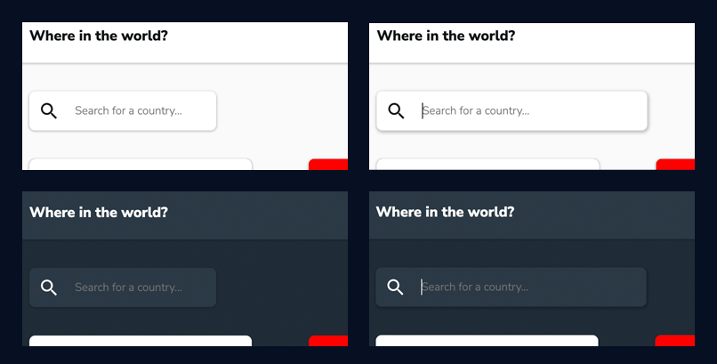
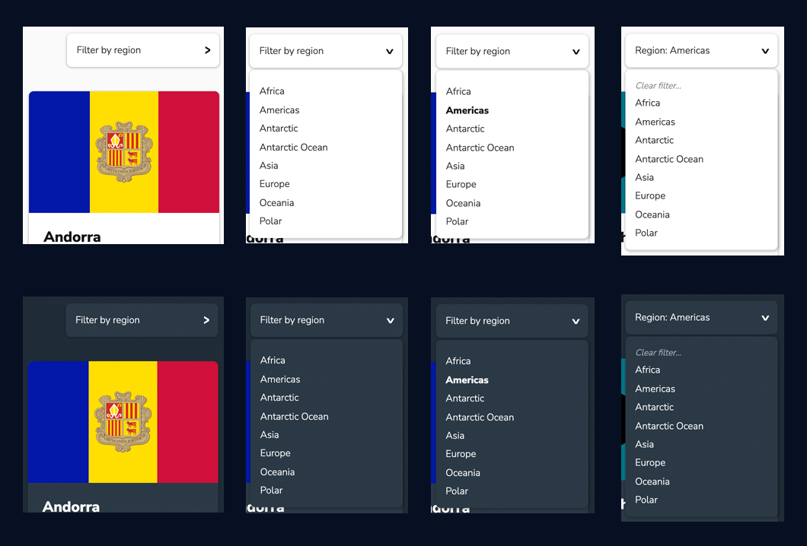
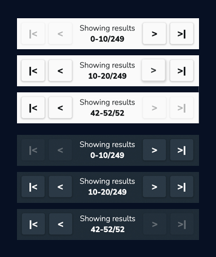
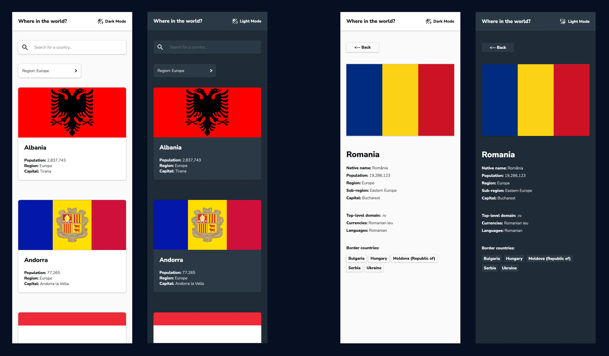

# Frontend Mentor - REST Countries API with color theme switcher solution

This is a solution to the [REST Countries API with color theme switcher challenge on Frontend Mentor](https://www.frontendmentor.io/challenges/rest-countries-api-with-color-theme-switcher-5cacc469fec04111f7b848ca). Frontend Mentor challenges help you improve your coding skills by building realistic projects.

## Overview

### The challenge

Users should be able to:

- See all countries from the API on the homepage
- Search for a country
- Filter countries by region
- Click on a country to see more detailed information on a separate page
- Click through to the border countries on the detail page
- Toggle the color scheme between light and dark mode
- Bonus: I added pagination, so you can navigate through the list of countries
### Screenshots

#### Home page

#### Details page

#### Features

#### Mobile

### Live deployment preview

[country-explorer-ten.vercel.app](https://country-explorer-ten.vercel.app/)
## My process

### Built with

- React.js with context
- Next.js with statically generated paths and props
- SCSS and CSS modules

### What I learned

I learned how to do pagination and I finally got some practice with getStaticPaths and getStaticProps.
The layout was no joke either.
### Continued development

I strongly believe the current component structure is not ideal. Architecture-wise, there are plenty improvements to be made.

I plan to come back and refactor for more "DRY"ness :)